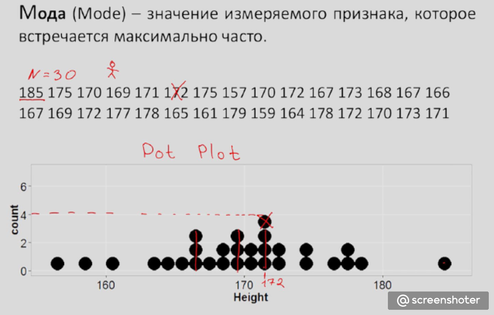
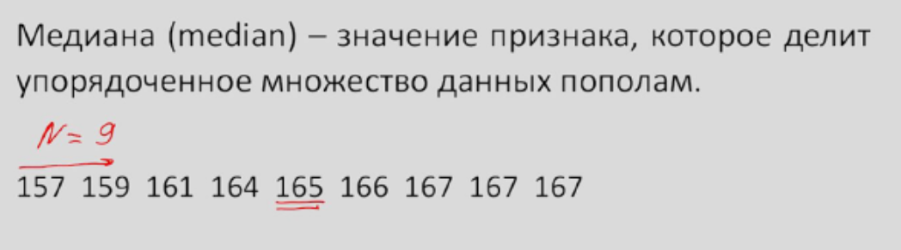

# Конспект по книге .Савельев В. - Статистика и котики - 2018.pdf

Котики бывают разные, разных размеров цвета и других признаков.
Как же нам понять как выглядит типичный котик.

Для простоты мы возьмем такое котиковое свойство, как размер.

Первый и наиболее очевидный способ – посмотреть, какой размер котиков встречается чаще всего.  Как бы, посчитать количество разных (уникальных) котиков во всей выборке и выбрать каких больше.
Такой показатель называется модой.
Мода (Mode) - значение измеряемого признака которое встречается максимально часто.

N - количество измерений.
172 - это Мода (Mode)

Второй способ - мы можем упорядочить всех котиков от самого маленького до самого крупного, а
затем посмотреть на середину этого ряда. Как правило, там находится котик, который обладает самым
типичным размером. И этот размер называется медианой.
Если количество измерений четное то берется среднее между двумя рядом стоящих.
Медиана (Median) - значение признака, которое делит упорядоченное множество данных пополам

N - количество измерений.
165 - это Медиана (Median)

Третий способ - нахождение наиболее типичного котика, по принципу взять и
сложить размер всех котиков и поделить на их количество. Полученное число
называется средним значением.

Эти понятия являются мерами центральной тенденции.

